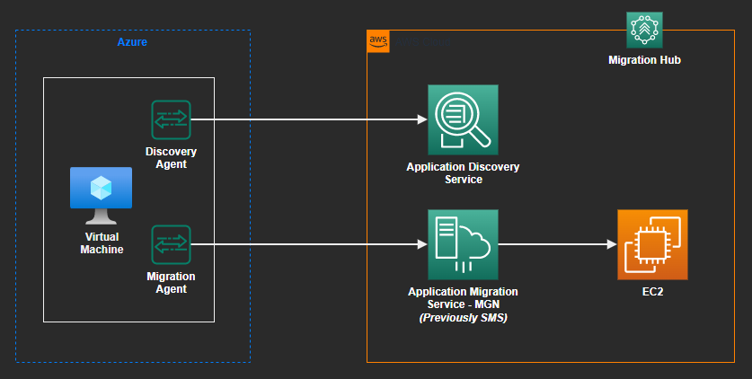
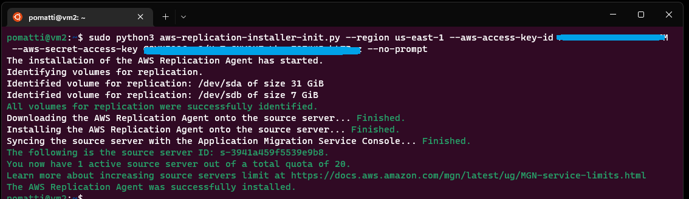

# AWS Migration

Migration exercise from Azure to AWS using Application Discovery Agent and Application Migration (MGN, previously SMS) Agent.



## Discovery

```sh
account='<your_account_id>'

aws iam create-user --user-name 'MigrationUser'
aws iam create-group --group-name 'MigrationGroup'
aws iam add-user-to-group --user-name 'MigrationUser' --group-name 'MigrationGroup'

cp templates/trust-policy-template.json trust-policy.json

sed -i "s/ACCOUNT_ID/$account/g" trust-policy.json

aws iam create-role --role-name 'MigrationRole' --assume-role-policy-document 'file://trust-policy.json'

aws iam attach-group-policy --policy-arn 'arn:aws:iam::aws:policy/AWSApplicationDiscoveryServiceFullAccess' --group-name 'MigrationGroup'
aws iam attach-group-policy --policy-arn 'arn:aws:iam::aws:policy/AWSApplicationDiscoveryAgentAccess' --group-name 'MigrationGroup'
```

Prepare the `cloud-init.sh` file. You

```sh
cp templates/cloud-init-template.yaml cloud-init.txt

aws iam create-access-key --user-name MigrationUser

AWS_KEY_ID=<key_id>
AWS_KEY_SECRET=<key_secret>

sed -i "s/AWS_KEY_ID/$AWS_KEY_ID/g" cloud-init.txt
sed -i "s/AWS_KEY_SECRET/$AWS_KEY_SECRET/g" cloud-init.txt
```

Create the migration source a separate cloud, or even AWS EC2 will do. Here's an example with Azure:

```sh
az group create -n 'rg-migration' -l 'brazilsouth'

# Use this VM for the Discovery Agent migration
az vm create -n 'vm1' -g 'rg-migration' --image 'UbuntuLTS' --custom-data 'cloud-init.txt'
```

The agent should automatically start collecting data. If not, troubleshoot to discover what might had gone wrong.

You should be able to connect directly from your terminal with your standard key.

```sh
ssh <your_user>@<ip_address>
```
Organize your discovery into applications:

```sh
aws discovery create-application --name 'UbuntuServer' --region 'us-east-1'
aws discovery list-configurations --configuration-type 'SERVER' --region 'us-east-1'
aws discovery associate-configuration-items-to-application --application-configuration-id '<value>' --configuration-ids '<value>' --region 'us-east-1'
```

Discovery process is complete.

## Migration

Navigate to the AWS Application Migration Service (MGN) and create a replication configuration template.

Add a server to migration. Follow the Console procedure to add the **AWS Replication Agent**, which is a different product. The console will help you create user `mgn-agent-installer` and the roles required for it (`AWSApplicationMigrationAgentInstallationPolicy`).



Replication should start immediately.


### Clean-up

Delete all of AWS resources, as well as the Azure resources.

```sh
az rg delete -n 'rg-migration' -l 'brazilsouth' -y
```